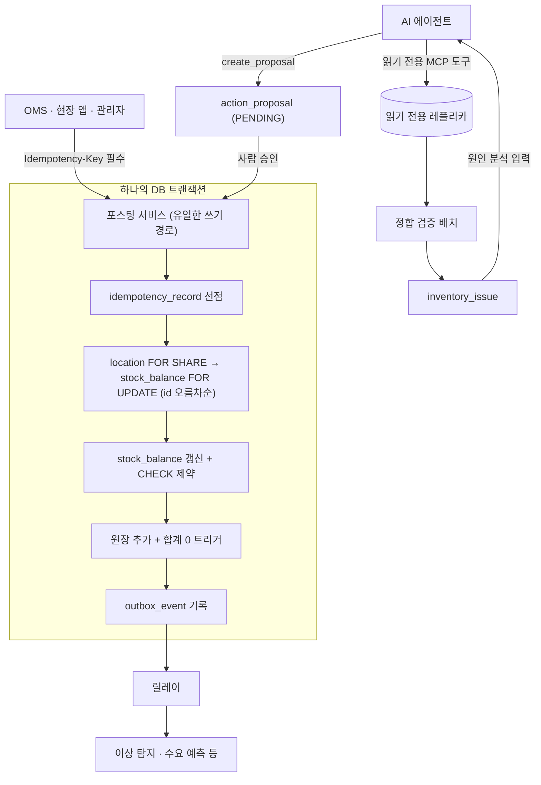

# 재고관리 코어 최소 설계

정합성 우선, AI 기능 확장 대비

## 문서 구성

| 문서 | 내용 |
|---|---|
| [설계 원칙과 불변식](01-principles.md) | 원장·복식부기·단일 쓰기 경로 원칙, 불변식 I1~I11 |
| [데이터 모델](02-data-model.md) | 테이블 14개 구성과 DDL 전문 |
| [거래 유형](03-transactions.md) | 입고·이동·출고·반품·조정·센터 간 이동·역분개 |
| [쓰기 경로](04-write-path.md) | 멱등성, 잠금 규칙, 포스팅·할당 흐름, 구현 메모 |
| [실사와 판매 가능 수량](05-count-session.md) | 실사 세션 상태 전이, 실사 중 재고의 노출·할당 정책 |
| [이벤트 발행과 정합 검증](06-events-reconciliation.md) | 트랜잭셔널 아웃박스, 정합 검증 배치 쿼리 ①~⑤ |
| [AI 연결 지점](07-ai-integration.md) | 권한 경계, 제안 실행 규칙, 기능별 데이터 매핑 |
| [테스트 전략과 구현 순서](08-testing-roadmap.md) | 동시성 테스트 시나리오, 4단계 로드맵, MySQL 8 부록 |
| [스키마 검증](09-schema-validation.md) | PostgreSQL 16에 DDL을 올려 유스케이스 83건을 돌린 기록과 스키마 관찰 |

## 범위와 전제

이 문서는 AI 기능을 올리기에 충분한 최소한의 재고관리 코어를 정의한다. 다루는 기능은 입고, 적치·이동, 할당, 출고, 반품, 조정, 역분개, 실사, 센터 간 이동, 정합 검증, AI 제안과 승인이다. 피킹 웨이브, 패킹, 운송장 발행, 부분 출고, 주문 관리는 범위 밖이며, 외부 시스템(OMS, 현장 앱)이 이 코어에 커맨드를 보낸다고 가정한다.

금액도 범위 밖이다. 입고 단가, 원가 계산(이동평균·선입선출), 재고자산 평가, 정산은 다루지 않으며, 이 코어는 수량과 위치만 책임진다. 금액은 ERP나 회계 시스템이 `StockPosted` 이벤트와 원장 id, 발주번호(`source_ref`)를 받아 계산한다. AI 기능이 우선순위 가중치로 금액이 필요하면 상품 마스터의 참고 단가를 분석용 뷰에서만 사용하고, 원장·잔액·제안 실행에는 넣지 않는다.

수량은 모두 기본 단위(EA) 정수로 저장한다. 박스·팩 단위 변환은 API 경계에서 끝내고 코어 안으로 들이지 않는다. 기술 스택은 Spring Boot 4.1과 **PostgreSQL 16 이상**을 전제한다. Java는 25를 가정하되 코드는 21 문법 범위 안에 있고, 실제 구현과 검증은 21에서 돌린다. Spring Boot 3.x는 2026년 6월 3.5를 끝으로 오픈소스 지원이 종료되어 새 프로젝트에는 쓰지 않는다.

PostgreSQL 의존은 이식성을 위해 줄이지 않고 의도적으로 받아들인다. 불변식을 DB 수준에서 강제한다는 것이 이 설계의 전제인데, 지연 제약 트리거(I3), 부분 유니크 인덱스(I10과 대기 중 제안 중복 방지), `INSERT ... ON CONFLICT`의 동시 삽입 처리(멱등 키 선점)가 모두 표준 SQL로는 표현되지 않기 때문이다. 표준 문법으로 바꾸면 지켜지던 불변식이 규약으로 내려앉는다. 대신 벤더 의존이 흩어지지 않도록 가둔다 — 애플리케이션 SQL은 리포지토리 계층에만 있고 서비스와 도메인은 DB를 모르므로, 다른 DB로 옮기게 되더라도 다시 쓸 것은 SQL 문장과 스키마지 애플리케이션이 아니다. MySQL 8을 쓴다면 무엇이 달라지는지는 [부록](08-testing-roadmap.md#부록-mysql-8을-쓴다면)에 정리했다.

정합성은 두 층위로 나눠서 다룬다. 시스템 내부 정합, 즉 잔액과 원장의 일치, 음수 재고와 초과 할당의 부재, 커맨드 중복 실행 방지는 소프트웨어가 보장할 수 있으므로 DB 수준에서 강제한다. 실물과 시스템의 일치는 소프트웨어가 보장할 수 없고 실사로 탐지해 보정하는 대상이므로, 탐지와 원인 추적에 필요한 데이터를 빠짐없이 남기는 데 집중한다. AI 기능은 주로 이 두 번째 층위에 들어간다.

## 전체 구조

